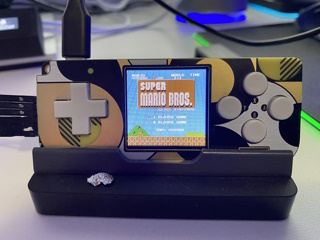
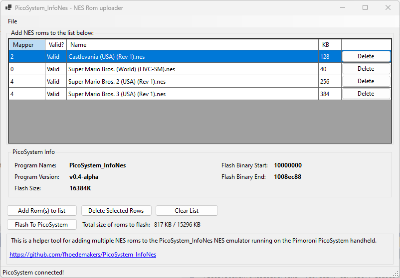

# PicoSystem_InfoNes a NES emulator for the Pimoroni PicoSystem RP2040 gaming handheld

## What is it

A Nintendo NES emulator for the Pimoroni PiocSystem RP2040 gaming handheld.

Emulater is bundled with the freeware homebrew game [Blade Buster](https://www.rgcd.co.uk/2011/05/blade-buster-nes.html).

See below for instructions how to flash the emulator on the PicoSystem and how to load games.

Store and play multiple Nintendo NES games on the [Pimoroni PicoSystem](https://shop.pimoroni.com/products/picosystem) RP2040 gaming handheld. A menu system is included for choosing your games to play.

There are two sound options:

- [Using the internal speaker. Low quality](#sound-through-internal-speaker)
- [Using a speaker mod, better quality](#speaker-mod-for-better-sound)

See below for more info

(Note: Screenshots below do not represent the actual picture quality. The distortion is caused by the camera)

|  ||
| ------------- | ------------- |
|  |   |


Click on image below to see a demo video. For more videos, including sound, see below.

[](https://www.youtube.com/watch?v=4VYKSMvYWc8)

## Where to buy the PicoSystem

- UK: [https://shop.pimoroni.com/products/picosystem?variant=32369546985555](https://shop.pimoroni.com/products/picosystem?variant=32369546985555)
- EU: [https://www.kiwi-electronics.com/en/picosystem-10913?search=picosystem](https://www.kiwi-electronics.com/en/picosystem-10913?search=picosystem)
- US: [https://www.adafruit.com/product/5289](https://www.adafruit.com/product/5289)

## Sound
### Sound through internal speaker
Sound through the internal piezo speaker is working but limited due to the limitations of this speaker. 

### Speaker mod for better sound
The sound quality will be much better (but not perfect and still somewhat limited) by modding the PicoSystem with a 8 Ohm 1W magnetic speaker. 
Those can be found [here for US](https://www.amazon.com/gp/product/B082658QXL/ref=ppx_yo_dt_b_search_asin_title?ie=UTF8&psc=1) and [here for Europe](https://www.amazon.nl/gp/product/B0BTYDS6FY/ref=ppx_od_dt_b_asin_title_s00?ie=UTF8&psc=1)


> This requires opening up the PicoSystem and some soldering. It is a simple mod, but I don't take responsibility when the PicoSystem gets damaged.

The speaker must be soldered to the RX (red wire) and ground pin of the PicoSystem as shown below:


You can toggle between speakers in-game by the Y + Down button combo.

Video to hear the difference between speakers:

[](https://youtu.be/BRUByhx4GDo)


## Uploading games and flashing the emulator
Since there is no SD card slot available, a companion app for Microsoft Windows is created that lets the user choose games and flash them to the Pico.
[More information here](https://github.com/fhoedemakers/PicoSystemInfoNesLoader). The app is included in the latest release. 
The application also allows you to flash the emulator when not installed or a newer version is available. No more need for manually flashing.



## Manually flashing the PicoSystem
- Download **PicoSystem_InfoNes.uf2** from the [releases page](https://github.com/fhoedemakers/PicoSystem_InfoNes/releases/latest).
- Connect PicoSystem using an USB-C cable to your computer. Make sure the PicoSystem is switched off.
- Push and hold the X button then the power-on button. Release the buttons and the drive RPI-RP2 appears on your computer.
- Drag and drop the UF2 file on to the RPI-RP2 drive. The PicoSystem will reboot and will now run the emulator.

## Manually uploading a game
Load single game rom by setting the device in BOOTSEL mode. (Connect to computer then Hold X and power on device)
The ROM should be placed at address **0x10110000**, and can be  transferred using [picotool](https://github.com/raspberrypi/picotool).

```
picotool load rom.nes -t bin -o 0x10110000
```

**Attention: the upload address has been changed from 0x10080000 to 0x10110000.** This is because of the additional size of the built-in game baked into the executable.

## Manually uploading multiple games

> All games must have the .nes extension and must be in the same directory

This can be done by creating a tar archive and upload this archive to the PicoSystem. The maxium size of the archive is be about 15MB

```bash
# current directory must contain the .nes roms
tar cvf games.tar *.nes
picotool load games.tar -t bin -o 0x10110000
```


## Button maps

- Y: is mapped to NES Select
- X: is mapped to NES Start

### In-game
- Y + X: Open menu
- Y + LEFT: Previous game
- Y + RIGHT: Next Game
- Y + UP: Start built-in freeware game [Blade Buster](https://www.rgcd.co.uk/2011/05/blade-buster-nes.html)
- Y + Down: Toggle between speakers. (Built-In - Added via Mod - Both - Mute)
- X + A: Toggle framerate
- Y + A: Volume up
- Y + B: Volume down

### In-Menu
- Up/DOWN: Scroll through list
- A : Start selected game
- B : Exit menu


## Screen Resolution
The original Nintendo Entertainment System has a resolution of 256x240 pixels. The PicoSystem has a resolution of 240x240 pixels. Therefore, on the PicoSystem the first and last 8 Pixels of each horizontal line are not visible.

## Credits
InfoNes is programmed by [Jay Kumogata](https://github.com/jay-kumogata/InfoNES) and ported for DVI output to the Raspberry PI Pico by [Shuichi Takano](https://github.com/shuichitakano/pico-infones). I used the port of Shuichi Takano as a starting point for this project.

Sound programmming by @newschooldev and @Layer812

## Things to do

- Code has to be cleaned up. Uses parts of the [PicoSystem library](https://github.com/pimoroni/picosystem).
